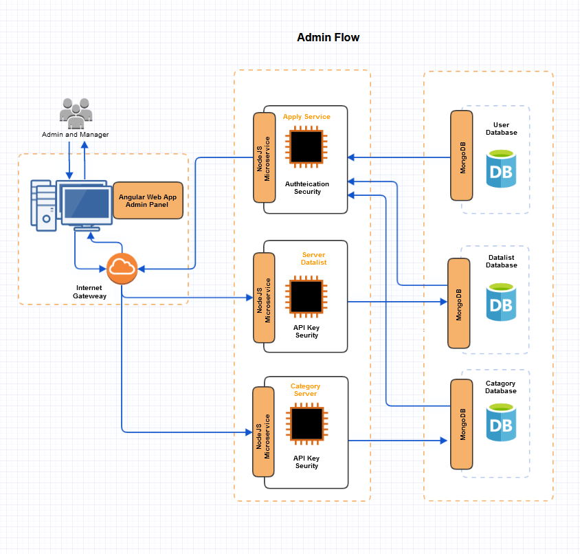
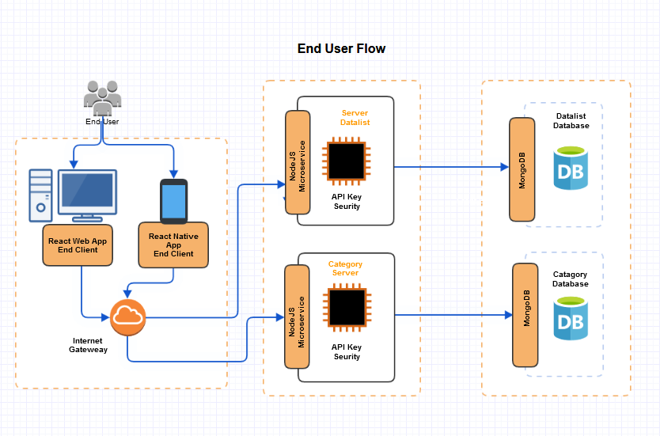

# Welcome to the MEAN MERN Boilerplate project

### _A boilerplate repository with all parts of the project, following production best practices._

In this repository, we will keep adding boilerplate code for a complete project which covers API, DB, Web, and Mobile platforms.
We should follow in both MEAN and MERN (MongoDB, Express.js, React.js, React-Native, Angular, and Node.js) in the project depending on the part of the project.
Different part of the project is arranged in different folders. Details of that part is available in the readme file inside that folder.<br/><br/>



## Technology stack

This repository is built on top of Express.js, React.js, React-Native, and Angular however in the implementation detail, we will find other supporting technologies as well.

#### Client side

- [React] - A JavaScript library for building user interfaces
- [Angular] - A JavaScript framework for building user interfaces]
- [React-Native] - A JavaScript framework used to develop applications mostly for Android and iOS.
- [MongoDB] - The application data platform
- [Testing Library] - React Testing Library
- [Axios] - Promise based HTTP client for the browser and node.js
- [RxJS] - Reactive Extensions Library for JavaScript.
- [NgRx] - Store is RxJS powered global state management for Angular applications, inspired by Redux.
- [Karma] - Karma is a task runner for our tests.
- [Jasmine] - Jasmine is a behavior-driven development framework for testing JavaScript code.
- [Cypress] - Cypress is a JavaScript end to end testing framework.

#### Server side

- [Node.js] - evented I/O for the backend
- [Express.js] - Fast, unopinionated, minimalist web framework for Node.js
- [Mongoose] - Mongodb object modeling for node.js
- [Swagger] - API development and testing tool
- [Jest] - JavaScript testing framework
- [Super Test] - Super test API testing framework

Details frameworks and packages can be found in the package.json files in the server and client directory.

## Features

- Information of diverse fields is shown to the end clients category-wise.
- In the admin panel data entry can be done after log in authentication.
- In the admin panel users have different levels of access.

## Parts

Following are the parts of the project. Details of each part are given in the readme file in folder to the correspondit part.

#### End client web application
This is the end client part of the project. This is a React single-page web app.<br/>
Folder: client_end

#### End client mobile application
This is the mobile phone version of the end client part of the project. This is a React-Native mobile app.<br/>
Folder: client_end_mobile

#### Admin panel web application
This is the admin panel part of the project. This is an Angular single-page web app.<br/>
Folder: client_admin_panel

#### Datalist server
This API serves the data list. This is a NodeJS microservice.<br/>
Folder: server_datalist

#### Catagory server
This API category list. This is a NodeJS microservice.<br/>
Folder: server_category

#### Data entry server
This API serves the following two functions:
- Create or update data and category items.
- Provide, create, and update user roles and permission items.
- Log in authentication.

This is a NodeJS microservice.<br/>
Folder: server-apply

## Running the application
This project can be run basically in two ways. One is using docker, other way is to run manually via vscode.

### Docker
work in progress

### Visual Studio Code

#### Prerequisites

- Node.js : To run npm packages
- MongoDB : As a database for the application

##### Steps

- To run via vscode, we should run the server and client side projects separately, and also make sure mongodb is up and running.
- To test the client side with mock data seed data to DB.

#### Server commands
We assume we run the MongoDB in the docker container.
```sh
cd server_<server name>
npm i
npm run db:up
npm start
```

#### Client commands

```sh
cd client_<client name>
nvm use --lts
npm i
npm start
```

## Data Seeding

To seed the database commands. It will seed data in setup folder to DB. 

```sh
npm run db:seed
npm run db:migrate
```

You should be able to see the username and password hash in the `/server/setup/users.json` file.
One admin user id as follows -
User id: saeed.sharman
Password: password1

## License

This project is [MIT licensed](https://opensource.org/licenses/MIT)

[node.js]: http://nodejs.org
[express.js]: http://expressjs.com
[docker]: https://www.docker.com
[react]: https://reactjs.org/
[mongodb]: https://www.mongodb.com/
[testing library]: https://testing-library.com/
[axios]: https://github.com/axios/axios
[mongoose]: https://mongoosejs.com/
[swagger]: https://swagger.io/
[jest]: https://jestjs.io/
[super test]: https://github.com/visionmedia/supertest
[Angular]: https://angular.io/
[React-Native]: https://reactnative.dev/
[Karma]: https://karma-runner.github.io
[Jasmine]: https://jasmine.github.io/
[NgRx]: https://ngrx.io/
[Cypress]: https://www.cypress.io/
[RxJS]: https://rxjs.dev/
