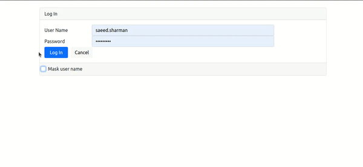
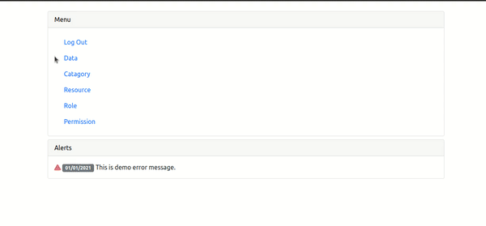

# Welcome to the admin panel part of MEAN MERN Boilerplate project

This is the admin panel part of the project. This is a single-page web app.

  

  

  

## Technology stack

This repository is built on top of Angular however in the implementation detail, we will find other supporting technologies as well.

#### Client side

- [Angular] - A JavaScript framework for building user interfaces.
- [RxJS] - Reactive Extensions Library for JavaScript.
- [NgRx] - Store is RxJS powered global state management for Angular applications, inspired by Redux.
- [Karma] - Karma is a task runner for our tests.
- [Jasmine] - Jasmine is a behavior-driven development framework for testing JavaScript code.
- [Cypress] - Cypress is a JavaScript end to end testing framework.

## Features

- In the admin panel data entry is done for users that have log-in credentials.
- In the admin panel users have different levels of access.
- Following is the access table:

| User Type | Data      | Catagory  | Resource  | Role      | Permission|
| ---------:| ---------:| ---------:| ---------:| ---------:| ---------:|
| Admin     | RW        | RW        | RW        | RW        | RW        |
| Manager   | RW        | RW        | R         | R         | R         |
| Editor    | RW        | R         | -         | -         | -         |

## Parts

#### Login page
- Users can log in with their user id and password.
#### Home page
- Home page has a menu with links to other pages. On this page alerts for the user are shown in a list view.
#### Data entry page
- Data is shown category-wise. All users can read, update and add data.
#### Category page
- All users can read, update and add the category.
#### Permission entry page
- Users with the admin role can read, update and add permissions. Users with manager roles can read permissions.
#### Resource entry page
- Users with the admin role can read, update and add resources. Users with manager roles can read resources.
#### Role entry page
- Users with the admin role can read, update and add roles. Users with manager roles can read roles.

## Development server

Run `npm start for a dev server. Navigate to `http://localhost:4200/`. The app will automatically reload if you change any of the source files.

## Build

Run `npm build` to build the project. The build artifacts will be stored in the `dist/` directory. Use the `--prod` flag for a production build.

## Running unit tests

Run `npm test` to execute the unit tests via [Karma].

## Running end-to-end tests

Run `npm run cypress:run` to execute the end-to-end tests via [Cypress].

## License

This project is [MIT licensed](https://github.com/Saeed1989/mern-mean-web-mobile-boilerplate/blob/main/client-admin-panel/LICENSE).

[node.js]: http://nodejs.org
[express.js]: http://expressjs.com
[docker]: https://www.docker.com
[Angular]: https://angular.io/
[Karma]: https://karma-runner.github.io
[Jasmine]: https://jasmine.github.io/
[NgRx]: https://ngrx.io/
[Cypress]: https://www.cypress.io/
[RxJS]: https://rxjs.dev/

