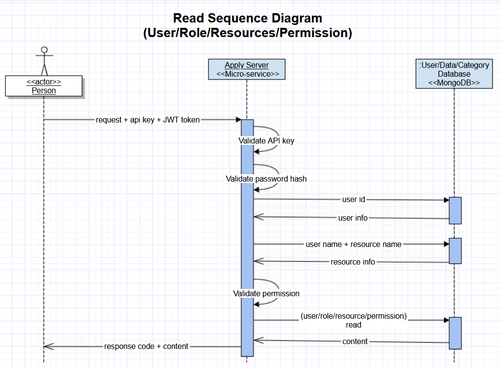

# Welcome to the apply server part of MEAN MERN Boilerplate project

In this repository, we will keep adding boilerplate code for the server part of apply API.
This API serves the following two functions:
1. Create or update data and category items.
2. Provide, create, and update user roles and permission items.
3. Log in authentication.

Operation for this API is authentication restricted. For every API endpoint authentication is checked.  

## Technology stack

This repository is built on top of Express.js however in the implementation detail, we will find other supporting technologies as well.

- [Node.js] - evented I/O for the backend
- [Express.js] - Fast, unopinionated, minimalist web framework for Node.js
- [MongoDB] - The application data platform
- [Mongoose] - mongoose
- [Swagger]
- [Jest]
- [Super Test]

Details frameworks and packages can be found in the package.json files in server and client directory.

## Features

- CRUD for users, resources, role, permission, catagory, data
- API is open to only authorised users
- Operations are restriced based on level of usrs authority

## Parts

### User controller
### Resource controller
### Role controller
### Permission controller
### Catagory controller
### Data controller

## License

This project is [MIT licensed](https://github.com/Saeed1989/mern-mean-web-mobile-boilerplate/blob/main/server_apply/LICENSE)

[node.js]: http://nodejs.org
[express.js]: http://expressjs.com
[docker]: https://www.docker.com
[react]: https://reactjs.org/
[mongodb]: https://www.mongodb.com/
[testing library]: https://testing-library.com/
[axios]: https://github.com/axios/axios
[mongoose]: https://mongoosejs.com/
[swagger]: https://swagger.io/
[jest]: https://jestjs.io/
[super test]: https://github.com/visionmedia/supertest
