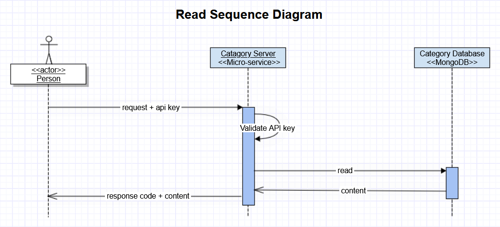

# Welcome to the datalist server part of MEAN MERN Boilerplate project

In this repository we will keep adding boilerplate code for the server part of catagory list api.
This api serves catagory list only without any authentication check.  

## Technology stack

This repository is built on top of Express.js however in the implementation detail, we will find other supporting technologies as well.

- [Node.js] - evented I/O for the backend
- [Express.js] - Fast, unopinionated, minimalist web framework for Node.js
- [MongoDB] - The application data platform
- [Mongoose] - Mongodb object modeling for node.js
- [Swagger] - API development and testing tool
- [Jest] - JavaScript testing framework
- [Super Test] - Super test API testing framework

Details frameworks and packages can be found in the package.json files in server and client directory.

## Features

- Get full catagory list
- Get data by catSku
- API is open without authorization check

## Parts

### Get: full catagory list
### Get: by catSku

## License

This project is [MIT licensed](https://github.com/Saeed1989/mern-mean-web-mobile-boilerplate/blob/main/server_catagory/LICENSE)

[node.js]: http://nodejs.org
[express.js]: http://expressjs.com
[docker]: https://www.docker.com
[react]: https://reactjs.org/
[mongodb]: https://www.mongodb.com/
[testing library]: https://testing-library.com/
[axios]: https://github.com/axios/axios
[mongoose]: https://mongoosejs.com/
[swagger]: https://swagger.io/
[jest]: https://jestjs.io/
[super test]: https://github.com/visionmedia/supertest
